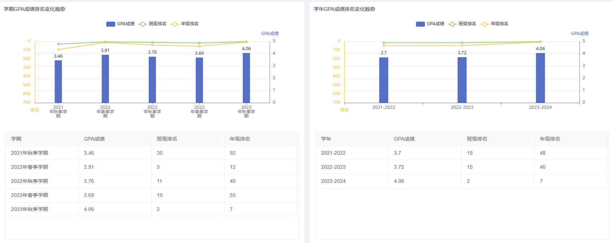

# 概览
## 中英文简历和成绩单
[普通成绩单中文_国内用_闫泽轩(PB21111696)](../docs/src/score_sheet.pdf)

[闫泽轩中文简历](../src/cv_zh.pdf)

[闫泽轩英文简历](../src/cv_en.pdf)

## 旧个人主页链接

[Yuri个人主页](http://home.ustc.edu.cn/~yzx_ustc)

目前该主页包括大一下python科学计算基础(罗奇鸣老师)课程的大作业，大一上思政课程自己用C语言手写的命令行刷题程序，剩下一个是程序设计与进阶课程的课程作业内容，未维护，属于未完成内容。

!!! note "注意事项"

    因国家互联网大环境影响，和学校政策调整，目前旧个人主页面临随时被河蟹的风险（尽管无任何风险内容），所以已经停止维护。    

## 自我介绍
中国科学技术大学2021级计算机科学与技术专业计科2班本科生（目前在华夏科技英才班）

能够使用C/C++,正在学习Rust,熟练使用Verilog,能快速上手html/css/javascript，熟练使用python

代码能力和工程能力较强，理论方面不擅长强调记忆性和细节区分类的工作，抽象性，联想性和洞察能力还可以。

数学能力方面，数学分析，线性代数和概率论与数理统计全部优秀。

英语四级584,六级470(大二上考，准备重考一遍),自我感觉阅读专业文献和网络查阅英文资料没有障碍。

担任团支书一职，同时多个学期担任小组组长，队长职务，较为熟悉团队管理和人际交往。

## 兴趣方向
通用人工智能，AIGC，处理器设计

## 学业成绩(截止至大三上)

