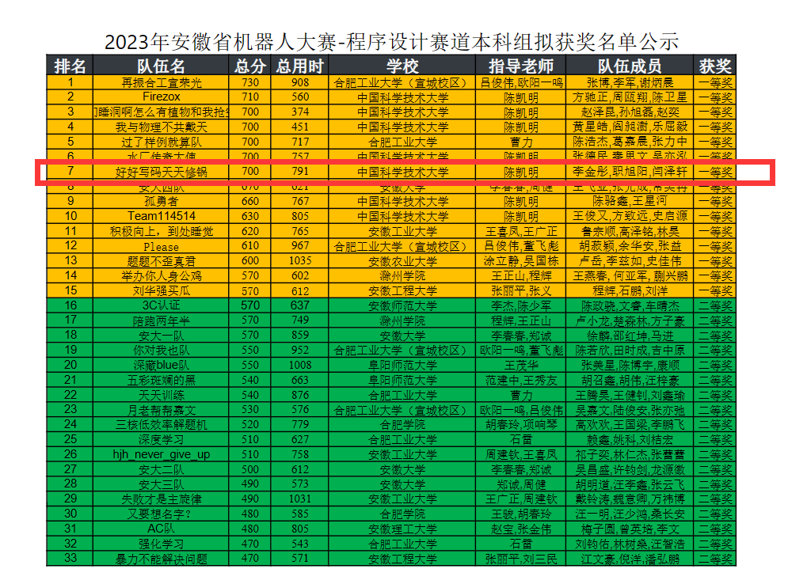

## 队名:好好写码天天修锅

在大二下参加，属于校算法竞赛社团参加的活动，我们称为“安徽省赛”, 活动的主要特色就是被科大屠榜

但是实际比赛中前两名被合工大队伍揽入囊中，我们戏称被薄纱。

比赛有十道题，我们完成了七道题，我贡献了其中的计算几何和网络流两道题。其他题目由队友李金彤和职旭阳完成。

算法竞赛是高中OI延续至大学的学科竞赛项目，大部分少年班同学和部分计科，信息学院同学具有至少省一以上的实力，我在高中从未接触过此类活动，进入大学后抽出课外时间和假期时间进行训练（说实话，训练时间仍然稀缺），在此类活动中安徽省赛应该是第一次获得有实质意义的算法竞赛奖项。

[获奖文件](../src/AnhuiOI.pdf)

