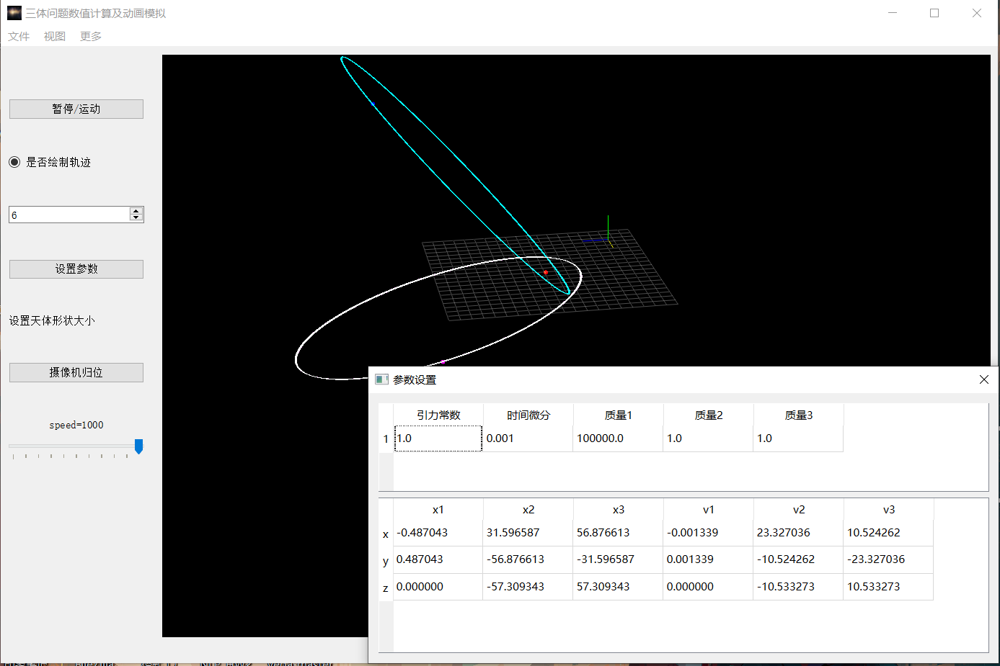

## python科学计算基础

这可能是我目前上过的对于我启发最大的一门课，不是说老师讲的有多好（当然罗老师自编讲义还是很敬业的），而是说他让我明白了得4.3的秘诀是什么。

这门课只验收一个大作业，学期前半期都只是上课半听半摸鱼，翻一翻讲过的包，看一看一些科学计算的python库的官网。后半学期真正开始动手要写的时候开始考虑，我应该如何选题。

最后选了一个“三体问题数值计算及动画模拟”的题目，实际的工作是使用pyqtgraph自带的3D操作界面，参考一本python科学计算的zlib电子书里给的三体运动的方程，再加上numpy,csv等数据格式处理的代码完成的运动仿真+三维模型展示的工作。并且在展示工作时使用了Sphinx的样式框架，样式完整而且非常美观。

我是第一个做上台汇报的，因为老师说过提前几堂课汇报有加分。同时自己完全相信自己的项目达到了自己的兴趣+能力展现+课程要求+超过平均水平的多重要求，所以我自信能拿到优秀，但是当实际拿到4.3的时候还是非常兴奋，直接在课程群中向老师说“老师我爱你”. 

在科大的评价体系下优秀的课程确实有共通之处，我认识的一位工院学长同样和我修过这门课，只是不在同一个学期修的（他现在应该是院系南波湾），有一次借他大物实验报告看的时候确实瞠目结舌，一般人按照实验流程走完，记录完数据，用Excel处理一下贴一下图就完事了，但是他立即就用上了学过的python计算库的处理的方法，同一组数据用不同的处理方式玩出了花，而且实验精度非常高，难怪连大物实验都能拿97分。

总之，__GPA4.3=很好的创新点+扎实的成果+美观的展示+自己的强烈的兴趣+超过一般同学的质量__

科研工作也许也有共同的评价指标。

## 程序设计与进阶

[课程大作业报告(docx)](../src/%E3%80%8A%E7%A8%8B%E5%BA%8F%E8%AE%BE%E8%AE%A1%E8%BF%9B%E9%98%B6%E4%B8%8E%E5%AE%9E%E8%B7%B5%E3%80%8B%E5%A4%A7%E4%BD%9C%E4%B8%9A%E6%9C%80%E7%BB%88%E7%89%88.docx)

!!! notice 
    docx中包含了项目文件和使用图片以及具体实现细节。

这门课是孙广中老师开设的一门偏向于软件工程的课程。大家可以组队定一个项目然后合作去完成。
课程的目的就是改变科大计科学生极度缺乏满足实际需求的应用的开发能力，因为有一个著名的笑话，就是科大学生出去找工作，只会C语言，Verilog，既不会python也不懂html/css/js，实际工程能力不如大专学生，唯一拿得出手的大概就是大家都不怎么会的量子物理和大物实验不确定度分析。

我提议做一个网页快照的服务网站，用户可以将网页链接发给我们的服务器，然后我们会去爬取然后保存，之后即使网页更改或者终止服务，原本的内容我们仍然可以提供。然后我就成了项目的总负责人，负责分工，召集开会，同时我要自学django,管理腾讯云服务器+对象存储服务。可以说我对这个项目做出了最大部分的贡献。这个过程中有一个组员是很摆的，开会不开，任务完不成，我也调整分工将不紧迫的任务分给他。事实证明即使是没那么紧迫也不困难的任务，摆子也还是摆子。但是幸好任务的分工没有将关键路径放在他身上，所以项目还是比较顺利的完成了。

课程接近结束的时候我们每个组要向孙老师和助教汇报进度，我在汇报时感到孙老师对我们的项目还是比较肯定的，同时我也发现很多队伍的实现更接近于半成品，证明我们的工作还是相对占优势的，事实上最后评分我们也都得到了4.0

另外，这门课还有许多小实验以及期末有一个上机环节，所以说任务量不小，对于很多同学来说难度应该是比较大的，可惜的是加上课程群环境维护的并不好，所以很多同学对这门课的评价不高。但是我是认为这门课对于锻炼同学们的工程能力是很有意义的，只是需要避免大杂烩的问题，比如又写了一遍高精度和n皇后这种实验。

## 总评与复盘

这学期如有神助，直接拿到3.91.除了大物实验外，门门优秀，与大一上学期形成了极其鲜明的对比。完全救回了我的自信心和自尊心，同时也将总GPA拉到3.70,比较稳固的进入了保研线。

我一直有一种看法就是在科大心理最压抑痛苦的就是30%\~50%的同学，因为名次前列的同学并不担心毕业出路，只是选择哪个更好的区别，而名次靠后的同学完全可以摆完整个本科生涯，如果要考研，也就是最后一年的努力而已了。而30%\~50%的同学需要时时担心自己的成绩挂在保研线的最后一名，因此不得不将自己所有的时间投入到卷GPA的活动中去，很少或几乎没有参与科研/竞赛/兴趣的机会，这样的大学生活难道不是十分痛苦的吗?

大一下的GPA大礼包直接把我送到20%，我总算可以考虑一些之前不敢考虑或者未曾考虑的层次高一些的问题和追求/规划了，不得不说可喜可贺，可喜可贺。