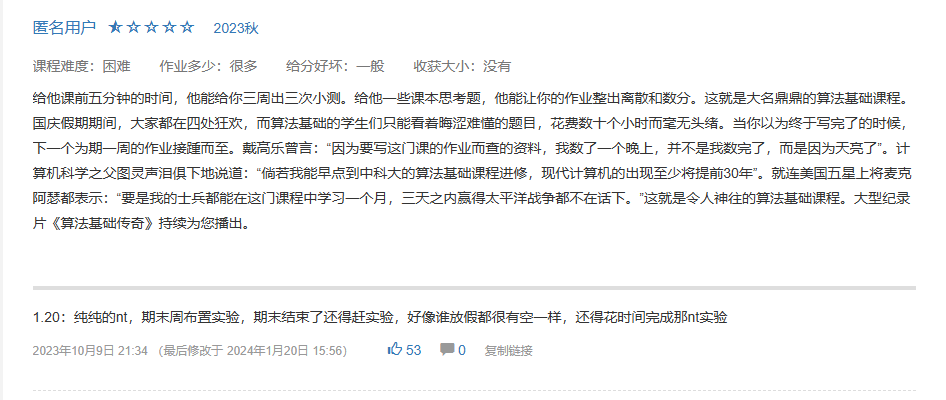

## 编译原理和技术
这门课的实验设计应该是科大CS首屈一指的好实验了，李诚老师被誉为“理想主义者”，在这门课的授课和实验中可见一斑。

实验是基于llvm的简化版light-IR，指令集是基于龙芯的自主指令集loongarch-64中的一部分，从语法树到中间代码生成再到机器码生成和优化，每一步都踏踏实实地让我们理解编译器的工作方式和底层原理。最后实现了一个完备的c-minus语法的编译器。

几位助教都非常用心，实验文档也很好，[实验文档主页](https://ustc-compiler-principles.github.io/2023/),相关的教学视频也发布在了龙芯的官方B站平台上，作为向全国编译原理课程推广的模范实验设计。

我个人上这门课的感受就是老师很好，助教很好，课程很好，但是我上课听不懂。最后都是面向作业题和答案来学习那些pass的作用还有怎么做数据流分析的。这门课整个学期只翘了一节课，不成想正好被抓到，尽管期末考试成绩还很不错，但是被卡绩到89，我总寻思和这有点关系。

## 算法基础

这门课由李向阳院长和谈海生副教授执教，有好几个学生助教，但是令我印象最深刻的还是无敌助教吴迪。

参见评课社区评论，

想挑战一下的可以看看第一次作业[hw1](../src/hw1.pdf)

总结起来就是非常难作业，非常多小测点名，非常多OJ和非常鸽子的“企业参观”。

期末考试有一道题当天上午的算法竞赛群里正好见过，秒了，爽的一批。

给分很奶，期末95昏，总评4.3美滋滋。

## 总结
这学期爆种了，出一个一个4.3，自己都不知道怎么回事。只有两门课拿了3.7，放在以前想都不敢想。其实以前拿那么多3.3也是稀里糊涂的未解之谜，总之这学期是GPA最高的一学期了。